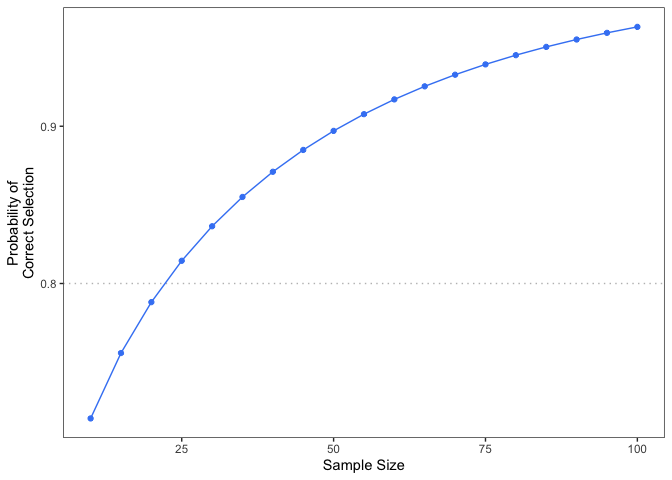

# Practical Equivalence Design

Zachary McCaw <br>
Updated: 2021-07-22


### Description

This package performs sample size estimation for designing a practical equivalence trial. The sample size calculation is based on a Weibull distribution for the time to event in each treatment arm. The Weibull distribution is parameterized in terms of the shape parameter $\alpha$ and the rate parameter $\lambda$:

$$
f(t) = \alpha\lambda (\lambda t)^{\alpha - 1}e^{-(\lambda t)^{\alpha}}.
$$

The hypothesized time to event distribution for each treatment arm may be specified by providing the shape and rate parameters, or by providing the median. If the median is provided, then $\alpha$ is taken as 1, which corresponds to an exponential distribution.

## Installation


```r
devtools::install_github(repo = 'zrmacc/Practical-Equivalence/PracticalEquiDesign')
```


## Examples
Sample size calculation for a median survival time of 6 months in the reference arm and 8 months in the treatment arm, with an estimated censoring rate of 20% and a 80% chance of selecting the more-effective treatment.


```r
set.seed(101)
library(PracticalEquiDesign)
n <- SampleSize(
  med1 = 6,
  med2 = 8,
  cens_prop = 0.2,
  target_prob = 0.8
)
sprintf("Sample size: %d.", n)
```

```
## [1] "Sample size: 26."
```

Probability of selecting the more-effective treatment at the recommended sample size.


```r
set.seed(101)
prob <- EquiProb(
  n = n,
  med1 = 6,
  med2 = 8,
  cens_prop = 0.2
)
sprintf("Probability of selecting the more-effective treatment: %.3f.", prob)
```

```
## [1] "Probability of selecting the more-effective treatment: 0.804."
```

Selection probability as a function of the sample size:


```r
set.seed(101)
q <- ProbCurve(
  med1 = 6,
  med2 = 8,
  cens_prop = 0.2,
  delta = 5,
  min_n = 10,
  max_n = 100,
  target_prob = 0.8
)
show(q)
```



By default, the margin of equivalence is zero. The following example specifies a practical equivalence margin of 1 month. 


```r
set.seed(101)
n <- SampleSize(
  med1 = 6,
  med2 = 8,
  cens_prop = 0.2,
  margin = 1,
  target_prob = 0.8
)
sprintf("Sample size: %d.", n)
```

```
## [1] "Sample size: 33."
```
