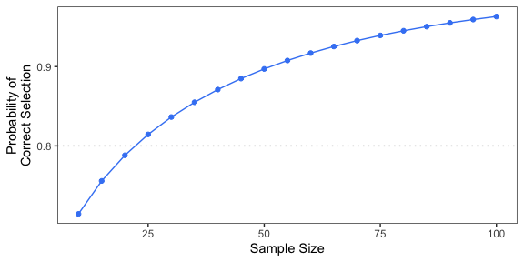

# Practical Equivalence Design

Zachary McCaw <br>
Updated: 2021-12-04

## Overview

This package performs sample size estimation for designing a practical equivalence trial with a time to event endpoint. The sample size calculation is based on a Weibull distribution for the time to event in each treatment arm. The Weibull distribution is parameterized in terms of the shape parameter $\alpha$ and the rate parameter $\lambda$, corresponding to the survival function:

$$
S(t) = e^{-(\lambda t)^{\alpha}}.
$$

The hypothesized time to event distribution for each treatment arm may be specified by providing the shape and rate parameters, or by providing the median. If the median is provided, then $\alpha$ is taken to be 1, which corresponds to assuming an exponential distribution for the time to event.

## Examples
### Calculation based on exponentials
`SampleSize` estimates the sample size requirement based on the censoring proportion `cens_prop`, the event-time distribution of each treatment arm, and the target probability of selecting the more-effective treatment `target_prob`. The following example considers sample size calculation for a median survival time of 6 months in the reference arm and 8 months in the treatment arm, with an estimated censoring rate of 20% and a 80% chance of selecting the more-effective treatment. Note that, because medians are provided, the calculation is based on exponential distributions. 


```r
set.seed(101)
library(PracticalEquiDesign)
n <- SampleSize(
  med1 = 6,
  med2 = 8,
  cens_prop = 0.2,
  target_prob = 0.8
)
sprintf("Sample size: %d.", n)
```

```
## [1] "Sample size: 23."
```

`SupProb` may be used to calculate the probability of selecting the superior treatment at a given sample size. For example, the probability of selecting the more-effective treatment at the sample size recommended by `SampleSize` is:


```r
set.seed(101)
prob <- SupProb(
  n = n,
  med1 = 6,
  med2 = 8,
  cens_prop = 0.2
)
sprintf("Probability of selecting the more-effective treatment: %.3f.", prob)
```

```
## [1] "Probability of selecting the more-effective treatment: 0.805."
```

`ProbCurve` plots the selection probability as a function of the sample size:


```r
set.seed(101)
q <- ProbCurve(
  med1 = 6,
  med2 = 8,
  cens_prop = 0.2,
  delta = 5,
  min_n = 10,
  max_n = 100,
  target_prob = 0.8
)
show(q)
```



By default, the margin of equivalence is zero. The following example increases the marginal of practical equivalence margin to 1 month. Note that increasing the margin of practical equivalence will generally increase the required sample size.


```r
set.seed(101)
n <- SampleSize(
  med1 = 6,
  med2 = 8,
  cens_prop = 0.2,
  margin = 1,
  target_prob = 0.8
)
sprintf("Sample size: %d.", n)
```

```
## [1] "Sample size: 28."
```

### Calculation based on Weibulls

Given the survival probabilities at two distinct time points, the function `WeibullSpec` determines the shape and rate parameter of the corresponding Weibull distribution. For example, suppose the anticipated survival at `t1 = 6` months is 80\% and that at `t2 = 12` months is 50\%. The corresponding Weibull distribution has shape and rate parameters:

```r
theta1 <- WeibullSpec(t1 = 6, p1 = 0.8, t2 = 12, p2 = 0.5)
show(round(theta1, digits = 3))
```

```
## shape  rate 
## 1.635 0.067
```

For the comparator arm, suppose the anticipated survival at `t1 = 6` months is 80\%, but that the median survival is `t2 = 14`. The corresponding Weibull is:

```r
theta2 <- WeibullSpec(t1 = 6, p1 = 0.8, t2 = 14, p2 = 0.5)
show(round(theta2, digits = 3))
```

```
## shape  rate 
## 1.338 0.054
```

To perform sample size estimation based on these hypothesized event-time distributions:

```r
set.seed(101)
library(PracticalEquiDesign)
n <- SampleSize(
  shape1 = theta1["shape"],
  rate1 = theta1["rate"],
  shape2 = theta2["shape"],
  rate2 = theta2["rate"],
  cens_prop = 0.2,
  target_prob = 0.8
)
sprintf("Sample size: %d.", n)
```

```
## [1] "Sample size: 43."
```
